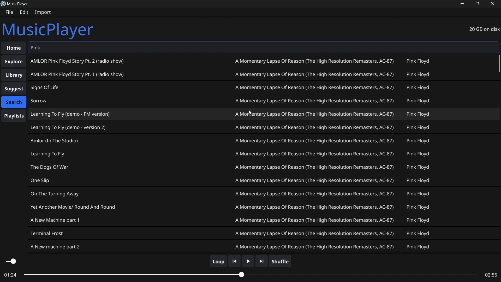

Please note that the full, original documentation (criteria A, B, C, D and E) are uploaded under the `Forms` folder.

The development time for this IA project was roughly 20 full days.
# Functionalities
## Video
If you would prefer a video demonstrating the functionalities, please refer to the video below. It is uploaded in the repository as `Crit_D_Video.mp4`. Please note that the video has been sped up to save time.
## Import tracks and store them in a database with the attributes found in the file
1. Please make sure to have music in the `~/Music/MusicPlayer` directory: []
2. Please start MusicPlayer and select **Import tracks to database** from the **Import** menu: []
3. After a pause (depending on the size of the imports), the following confirmation will be displayed. Please note that only audio formats will be imported. []
4. Please restart MusicPlayer. Upon doing so, the (clickable) albums covers (fetched from the embedded artwork) should be visible in the **Home** view: []
## Play/pause, loop, play the next/previous tracks (in the context of an album or playlist), increase/decrease the volume
Please note that the shuffle button is non-functional.
1. After ensuring that tracks have been imported, please click on an album cover in the **Home** view to see its tracks in the corresponding **Library** view: []
2. Please single-click a track to select it. Upon doing so, it will turn blue: []
3. Please use the **space bar** or click on the **play/pause button** from the provided media control buttons to play or pause the selected track: []
4. If you would like to **seek** to a particular point in the track currently playing (or use the other media controls available), please make sure to first **pause** the track (implementation limitation). To then seek to the desired point, please click along the **time slider**: []
5. Please then **play** the track.
6. Please click on the button to the left of the **play/pause button** to go to the **previous track**: []
7. Please click on the button to the right of the play/pause button to go to the **next track**: []
8. The left-most media control is the **loop** button. Please click on it to loop tracks: []
9. Please use the volume slider in the bottom-left to adjust the volume of the music being played. This is a local control that does not affect the system's volume: []
## Fetch artist information using an API
In general, please allow API operations that involve fetching images a few seconds.
1. From a particular **Library** view (for an album), please navigate to the corresponding **Explore view**: []
2. Please click on the one accordion corresponding with the artist's name
	1. If the **Country**, **Disambiguation**, and **Type** information for the artist could not be retrieved (independent of **Tags** and **Release Groups** information), the following will be shown: []
	2. If it could be shown, then it looks like the following: []
3. Please click on the **Tags** accordion to reveal the tags associated with the artist, according to the API: []
4. Please collapse the open sub-accordion, or choose to scroll down and directly click on the **Release Groups** accordion to view the albums released by the artist, according to the API: []
## Create playlists with the imported tracks (limited implementation)
==Please note only this exact series of steps works.==
1. Please navigate to the **Playlists** view: []
2. Please enter the name of the playlist you would like to create in the text box: []
3. Please press the **Enter/Return key** on the keyword to create the playlist with the desired name. Then, please refresh the **Playlists** view by clicking on it again from the left-hand menu (implementation limitation). An accordion is now visible with the empty playlist: []
4. This step may be repeated as many times as tracks need to be added, from the same or different albums. Please navigate to the **Home** view, and select the desired album (from which tracks are to be added to the newly created playlist). This selection will result in the **Library** view being opened for the corresponding album (as demonstrated as part of an earlier functionality). Navigating to the desired track, please click on its associated **+ button** to add the track to a one of the created playlists from the dropdown (another playlist and other tracks have already been added for demonstration purposes): []
5. Please navigate back to the **Playlists** view to see all the playlists, with the tracks added to them (please note that these screenshots are not in any particular order):
	1. []
	2. []
6. Please click on any of the individual tracks and press the **play button** or the **space key** to play them. Please note that the **prev/next buttons** only work within the context of **albums**, and not **user-created playlists** (implementation limitation).
## Search imported tracks by their name
1. Please navigate to the **Search** view, enter a search term (from any of the fields) and press the **Return/Enter key** on the keyword to execute the search and view the results below: []
2. Please click on a track and press the **play button** or the **space key** to play it.
## Show analytics based on music listening
Please note that an SQL query has been executed to add random listening data for demonstration purposes. Please refer to the video for the details.
1. Please navigate to the **Suggest** view.
### Listens on Top 10 Genres
[]
### Listens on Top 10 Artists
[]
### Listens on Top 10 Albums
[]
